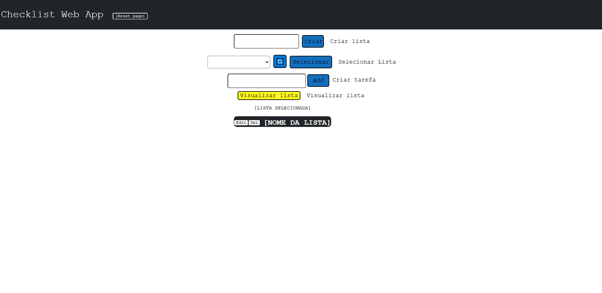

# Checklist Web App

## Passos para execução e funcionamento básico
- Instalar os requerimentos necessários.
- Executar o arquivo `main.py`.
- Ir para o navegador na porta padrão.
- Passo a passo para usar [ver em funcionamento](other/gif.gif):
    - Criar uma lista
    - Atualizar a lista de listas
    - Selecionar uma das listas (e apertar em selecionar)
    - Criar uma tarefa.

## Features
- Permite ao usuário:
    - Criar listas de tarefas
    - Criar tarefas dentro dessas listas
    - Deletar listas e tarefas
    - Editar listas e tarefas

## Informações principais
- Utiliza Python 3.9.6
- Só foi testado no Windows 10.
- Testado no Microsoft Edge.
- Não possui autenticação.
- Bibliotecas utilizadas:
    - sqlite3 (padrão)
    - Flask
    - Flask-RESTful
    - SQLAlchemy

## Requerimentos necessários
Para instalar os requerimentos necessários, nas versões corretas. Inserir comando `pip install -r requirements.txt`.

## Em funcionamento
