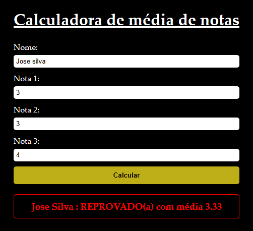

# Calculadora de média de notas

## Descrição

Calculadora de média de notas feita em HTML, CSS e JavaScript. Utiliza event listeners e forms.

## Uso

1. Insere nome.
2. Insere cada nota.
3. Clica em calcular.
4. Visualiza o resultado.

## Print

